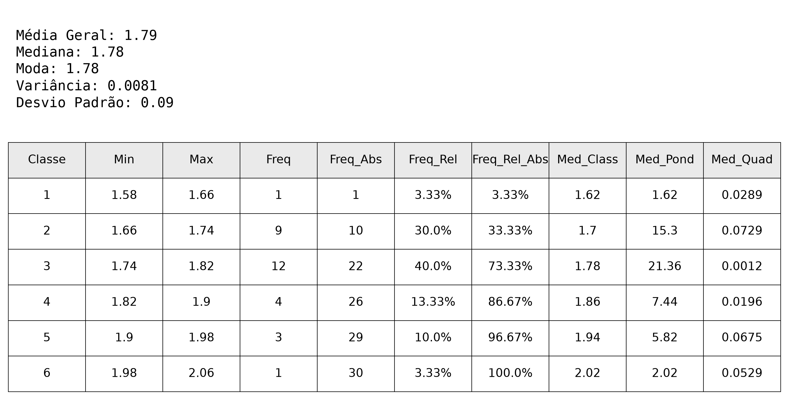

# EstatísticaClasses

Ferramenta em Python para **análise estatística descritiva por classes** a partir de um arquivo CSV: monta a distribuição de frequências (regra de Sturges), calcula médias, mediana, moda, variância e desvio padrão, e exporta o resultado como uma imagem `.png` com tabela e resumo.



## Funcionalidades

- Leitura de valores numéricos a partir de um CSV
- Cálculo automático do número de classes (regra de Sturges: `n_classes = ceil(sqrt(n))`)
- Definição dos limites (Min/Max) de cada classe
- Cálculo de frequência, frequência absoluta, frequência relativa e frequência relativa acumulada
- Cálculo de média da classe, média ponderada e média quadrática
- Cálculo de média geral, mediana, moda, variância e desvio padrão
- Exportação de uma tabela + resumo estatístico como imagem PNG (via `matplotlib`)

## Estrutura do projeto

```
EstatisticaClasses/
├── src/
│   ├── main.py                  # Ponto de entrada: lê o CSV e gera o relatório
│   └── Calculos/
│       ├── __init__.py
│       ├── basic_calculos.py    # Funções auxiliares (arredondamento, casas decimais)
│       ├── classe.py            # Orquestra a construção das classes
│       ├── frequencias.py       # Cálculo de frequências
│       ├── media.py             # Cálculo de médias, mediana e moda
│       └── erro.py              # Cálculo de variância e desvio padrão
├── requirements.txt
└── README.md
```

## Requisitos

- Python 3.11 ou superior
- Dependências listadas em `requirements.txt` (principais: `pandas`, `matplotlib`)

## Instalação

```bash
git clone https://github.com/GDHAF/class-stats-py
cd EstatisticaClasses

python -m venv .venv
source .venv/bin/activate      # Windows: .venv\Scripts\activate

pip install -r requirements.txt
```

## Como usar

Execute o `main.py` como módulo, a partir da raiz do projeto (necessário por causa do import `from src.Calculos.classe import Calc_Classes`):

```bash
python -m src.main
```

O programa vai pedir o caminho do arquivo CSV com os valores a serem analisados:

```
Digite o caminho do arquivo CSV: dados/exemplo.csv
```

### ⚠️ Formato esperado do CSV

O `main.py` lê cada linha do CSV esperando **duas colunas por valor** — a parte inteira e a parte decimal — e as junta com um ponto:

```python
n_valores = [float(row[0] + "." + row[1]) for row in reader]
```

Isso é útil quando o CSV foi exportado de uma planilha em padrão brasileiro (vírgula como separador decimal), já que ao abrir esse tipo de arquivo como CSV separado por vírgula, o número `1,78` acaba virando duas colunas: `1` e `78`. Exemplo de CSV compatível:

```csv
1,58
1,66
1,74
1,78
```

Ao final, o programa imprime os resultados no terminal e gera o arquivo `resultado_estatistico.png` na raiz do projeto.

## Tecnologias

- Python
- pandas
- matplotlib
